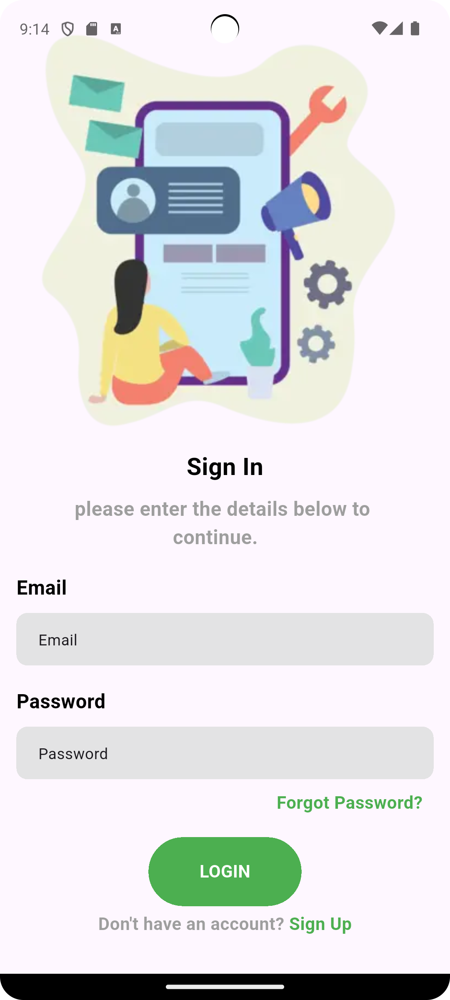
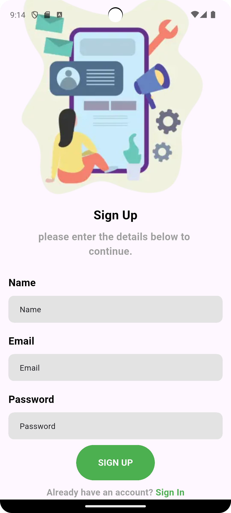
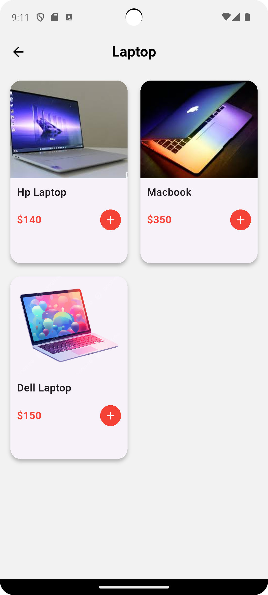
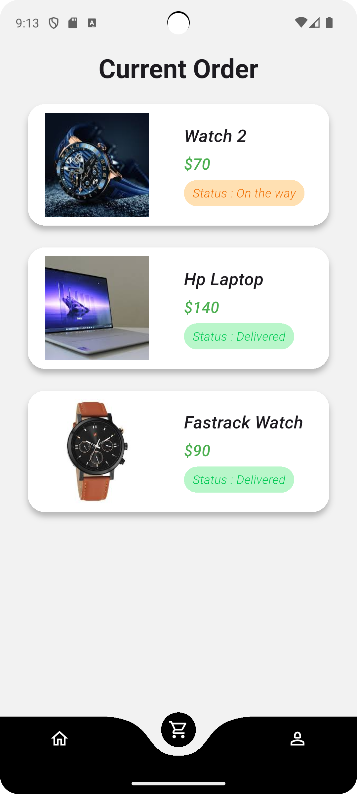

# E-commerce App 🛍️

**E-commerce App** is a full-featured e-commerce mobile application with an admin panel to manage products, orders, and users. Built for both Android and iOS using Flutter.  
This app provides a complete shopping experience, including product browsing, cart management, checkout, and admin controls.

---

## 🚀 Features

### 📦 User App
- User authentication (Sign up / Login)
- Product listing & search
- Filter & sort products
- Add to cart / Remove from cart
- Checkout & order placement
- Profile management

### 🛠️ Admin Panel
- Admin login
- Add / edit / delete products
- View all orders
- Manage categories
- Dashboard with analytics *(if available)*

---

## 📸 Screenshots / Demo












---

## 🧰 Tech Stack

| Layer | Technology |
|-------|------------|
| Frontend | Flutter |
| Backend  |Firebase, Dart |
| Database |Firestore|
| State Management | Provider |

---

## 📝 Requirements

Make sure you have the following installed:

- Flutter >= 3.x
- Android Studio / Xcode
- Node.js (if backend is included)
- Firebase CLI (if using Firebase)

---

## 🛠️ Installation & Setup

1. **Clone the repo**
   ```bash
   git clone https://github.com/Aditya073/ecommerce_app.git
   cd ecommerce_app
